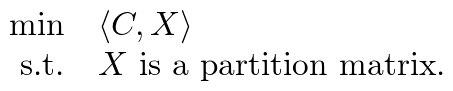
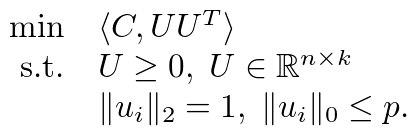

# RBR
---
RBR (Row-By-Row) is a fast solver for community detection type problems. It is mainly
implemented in C language, with OpenMP support. We also provide more friendly
interfaces for MATLAB users.

## Introduction
RBR is a modularity-based community detection method, which solves the 
modularity maximization problem



via non-convex relaxation:



The matrix `U` is optimized row by row asynchronously.

RBR requires the number of clusters `k` to perform clustering. It has a good
performance even if `k` is small.

## How to Install
RBR has only been tested on Linux currently. To use RBR you will need a recent
Linux operating system with:
- A recent version of CMake3
- A C compiler with OpenMP support
- A C++11 compiler (g++ >= 4.8 is fine)
- Any BLAS implementation with C interface (CBLAS)

First download the source code and unzip anywhere you like.

Then configure using `cmake`
```
mkdir build
cd build
cmake -DCMAKE_BUILD_TYPE=Release ..
```

Type `make` to build. If the build is successful, you will see
`libRBR.so` and `rbr` in the current directory.

### Using BLAS
RBR uses OpenMP to perform parallelization explicity. Thus a **non-threaded**
version of BLAS is preferred. If you are using [Intel MKL](https://software.intel.com/en-us/mkl),
it is recommended to use the sequential library `libmkl_sequential.so`.
This can be configured by adding `-DBLA_VENDOR=Intel10_64lp_seq` option
when invoking `cmake`.
```
cmake -DBLA_VENDOR=Intel10_64lp_seq ..
```

### Compile the MATLAB interface
To compile the MATLAB interface you'll need a recent MATLAB distribution.
Then pass the `-DBUILD_MATLAB_INTERFACE=ON` and optionally `-DMatlab_ROOT`
to the `cmake` command.
```
cmake -DBUILD_MATLAB_INTERFACE=ON -DMatlab_ROOT=/opt/MATLAB ..
```

## Usage
To use RBR, type `./rbr -h` to see the usage. You can also run the examples
we provide:
```
./rbr -v --full ../examples/polblogs 2
./rbr -v ../examples/amazon 100 5
```

RBR currently only supports
[Rutherford Boeing (RB) Sparse Matrix File Format](http://people.math.sc.edu/Burkardt/data/rb/rb.html)
as input. More formats will be supported in the future release.

## References
- [Junyu Zhang, Haoyang Liu, Zaiwen Wen, and Shuzhong Zhang, A sparse completely positive relaxation of the modularity maximization for community detection](https://epubs.siam.org/doi/abs/10.1137/17M1141904)

## The authors
We hope that the package is useful for your applications. Please feel free
to contact the authors if you have any comments or bug reports.

- Haoyang Liu (liuhaoyang@pku.edu.cn)
- Zaiwen Wen  (wenzw@pku.edu.cn)

## Copyright
RBR

Copyright (C) 2021  Haoyang Liu (liuhaoyang@pku.edu.cn)
                    Zaiwen Wen  (wenzw@pku.edu.cn)

This program is free software: you can redistribute it and/or modify
it under the terms of the GNU General Public License as published by
the Free Software Foundation, either version 3 of the License, or
(at your option) any later version.

This program is distributed in the hope that it will be useful,
but WITHOUT ANY WARRANTY; without even the implied warranty of
MERCHANTABILITY or FITNESS FOR A PARTICULAR PURPOSE.  See the
GNU General Public License for more details.

You should have received a copy of the GNU General Public License
along with this program.  If not, see <http://www.gnu.org/licenses/>.
