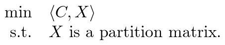
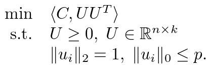

# RBR
---
RBR (Row-By-Row) is a fast solver for community detection type problems. It is mainly
implemented in C language, with OpenMP support. We also provide more friendly
interfaces for MATLAB users.

## Introduction
RBR is a modularity-based community detection method, which solves the 
modularity maximization problem



via non-convex relaxation:



The matrix `U` is optimized row by row asynchronously.

RBR requires the number of clusters `k` to perform clustering. It has good
performance even if `k` is small.

## Install RBR
To compile RBR you will need the following dependencies:

- A recent version of CMake3 (cmake >= 3.5)
- A C compiler with C99 and OpenMP support
- A C++ compiler with C++11 support
- Any BLAS implementation with 32 or 64-bit integer and C interface (CBLAS)

First download the source code and unzip anywhere you like.

Then configure using `cmake`
```
mkdir build
cd build
cmake -DCMAKE_BUILD_TYPE=Release ..
```

Type `make` to build. If the build is successful, you will see
`src/libRBR.so` and `src/main/rbr` in the build directory.

Optionally, type `make install` to install all necessary files to the
destination folder specified by `-DCMAKE_INSTALL_PREFIX`.

### Using BLAS
RBR uses OpenMP to perform parallelization explicity. Thus a **non-threaded**
version of BLAS is preferred. If you are using [Intel MKL](https://software.intel.com/en-us/mkl),
it is recommended to use the sequential library `libmkl_sequential.so`.
This can be configured by adding `-DBLA_VENDOR=Intel10_64lp_seq` option
when invoking `cmake`.
```
cmake -DBLA_VENDOR=Intel10_64lp_seq ..
```

When the sequential library is not available, you can also try specifying
some runtime environment varirables to control the number of computing threads of the
BLAS implementation. For example, with OpenBLAS one can set

```
OPENBLAS_NUM_THREADS=1 ./rbr <args>
```

### Using ILP64

To build RBR using CBLAS with 64-bit integer interface, please specify
the `-DUSE_ILP64=ON` option when invoking `cmake`:

```
cmake -DUSE_ILP64=ON ..
```

In this case `RBR_INT` is defined as `int64_t`.

### Compile the MATLAB interface
To compile the MATLAB interface you'll need a recent MATLAB distribution.
Then pass the `-DBUILD_MATLAB_INTERFACE=ON` and optionally `-DMatlab_ROOT_DIR`
to the `cmake` command.
```
cmake -DBUILD_MATLAB_INTERFACE=ON -DMatlab_ROOT_DIR=/opt/MATLAB ..
```

#### Known Issue:
MATLAB will crash if the library `libRBR.so` is linked against dynamic BLAS
libraries. This is because by default MATLAB preloads 64-bit integer BLAS
libraries, which may conflict with RBR's external BLAS libraries.
To solve the issue, try one of the following solutions:
- Build RBR with ILP64.
- Build RBR using **static** BLAS libraries **compiled with** `-fPIC`. E.g.
  ```
  cmake -DBLA_STATIC=ON -DBLA_VENDOR=Intel10_64lp_seq ..
  ```
- (Not recommended) Preload the **dynamic** BLAS libraries before starting MATLAB. E.g.
  ```
  LD_PRELOAD=/path/to/blas/lib/libblas.so matlab
  ```

See [this page](https://stackoverflow.com/questions/20544265/use-external-blas-and-lapack-libraries-in-a-matlab-mex-file) for more details.

## Usage
To use RBR, type `./rbr -h` to see the usage. You can also run the examples
we provide:
```
./rbr -v --full ../examples/polblogs 2
./rbr -v ../examples/amazon 100 5
./rbr -v --full ../examples/sbm 4
./rbr -v ../examples/email-Enron 100 5
```

RBR currently only supports
[Rutherford Boeing (RB) Sparse Matrix File Format](http://people.math.sc.edu/Burkardt/data/rb/rb.html)
as input. More formats will be supported in the future release.

## Supported Systems

### Linux

Most Linux distros are suppored. Intel MKL is supported.

E.g. to install dependencies on Ubuntu:

```
sudo apt install gcc g++ cmake libopenblas-dev
```

### Windows

Msys2/mingw64 is supported. To install the dependencies, use

```
pacman -S mingw-w64-x86_64-cmake mingw-w64-x86_64-gcc mingw-w64-x86_64-openblas
```

**Note**: Intel MKL is **NOT** supported on Windows/msys2.

### MacOS

Please use homebrew to install the dependencies before compiling.

```
brew install cmake libomp openblas 
```

## References
- [Junyu Zhang, Haoyang Liu, Zaiwen Wen, and Shuzhong Zhang, A sparse completely positive relaxation of the modularity maximization for community detection](https://epubs.siam.org/doi/abs/10.1137/17M1141904)

## The authors
We hope that the package is useful for your applications. Please feel free
to contact the authors if you have any comments or bug reports.

- Haoyang Liu (liuhaoyang@pku.edu.cn)
- Zaiwen Wen  (wenzw@pku.edu.cn)

## Copyright
RBR

Copyright (C) 2023  Haoyang Liu (liuhaoyang@pku.edu.cn)
                    Zaiwen Wen  (wenzw@pku.edu.cn)

This program is free software: you can redistribute it and/or modify
it under the terms of the GNU General Public License as published by
the Free Software Foundation, either version 3 of the License, or
(at your option) any later version.

This program is distributed in the hope that it will be useful,
but WITHOUT ANY WARRANTY; without even the implied warranty of
MERCHANTABILITY or FITNESS FOR A PARTICULAR PURPOSE.  See the
GNU General Public License for more details.

You should have received a copy of the GNU General Public License
along with this program.  If not, see <http://www.gnu.org/licenses/>.

## Other Languages

- [简体中文](docs/README_zh.md)
