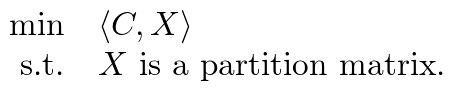
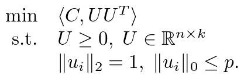

# RBR
---
RBR (Row-By-Row) 是求解社区检测问题的快速求解器。主要使用 C 语言实现，
并基于 OpenMP 实现并行计算。此外我们还为 MATLAB 用户提供了更加易于使用的接口。

## 求解器介绍
RBR 是基于 modularity 的社区检测算法，主要求解器极大化 modularity 优化问题



的非凸松弛问题：



矩阵 `U` 在迭代时采用异步逐行更新的优化策略。

RBR 在聚类时需要事先提供类别总数 `k`。当 `k` 很小时 RBR 也有不错的聚类效果。

## 编译安装

编译 RBR 需要如下依赖：

- 近期版本的 CMake (cmake >= 3.5)
- C 编译器，支持 C99 和 OpenMP
- C++ 编译器，支持 C++11
- BLAS 以及对应 C 语言接口（CBLAS），接口整数类型是 32 位或 64 位整数

首先下载源码并解压。之后使用 `cmake` 配置编译：

```
mkdir build
cd build
cmake -DCMAKE_BUILD_TYPE=Release ..
```

使用 `make` 编译。若编译成功，在当前编译目录下会看到动态库
`src/libRBR.so` 以及可执行程序 `src/main/rbr`。

作为可选，可以使用 `make install` 将所需文件安装到由 `-DCMAKE_INSTALL_PREFIX`
选项所指定的位置。

### 使用 BLAS

RBR 内部显式使用 OpenMP 并行，因此建议使用**非并行版**的 BLAS 进行链接。
例如，如果使用了 [Intel MKL](https://software.intel.com/en-us/mkl)，
推荐使用串行 MKL 库 `libmkl_sequential.so`。
为此在调用 `cmake` 进行配置时使用参数 `-DBLA_VENDOR=Intel10_64lp_seq` 指定。
```
cmake -DBLA_VENDOR=Intel10_64lp_seq ..
```

当不便使用串行库时，也通过在运行时指定环境变量的方式来控制 BLAS 所使用的线程数量。
例如对于 OpenBLAS，可使用如下方式设置：

```
OPENBLAS_NUM_THREADS=1 ./rbr <args>
```

### 使用 ILP64（64 位整数 BLAS 接口）

要使用 64 位整数接口的 BLAS 编译 RBR，请在调用 `cmake` 进行配置时添加 `-DUSE_ILP64=ON`
选项：

```
cmake -DUSE_ILP64=ON ..
```

在这种情况下，软件中 `RBR_INT` 类型被定义为 `int64_t`。

### 编译 MATLAB (MEX) 接口

要编译 MATLAB 接口需要近期的 MATLAB 发行版，并在编译时给定 `-DBUILD_MATLAB_INTERFACE=ON`
参数。若要指定安装位置请使用 `-DMatlab_ROOT_DIR` 参数。
```
cmake -DBUILD_MATLAB_INTERFACE=ON -DMatlab_ROOT_DIR=/opt/MATLAB ..
```

#### 已知问题

当使用 BLAS 动态库链接 `libRBR.so` 时，MATLAB 运行时可能会崩溃。
原因是默认情况下 MATLAB 使用 64 位整数接口的 BLAS，可能与 RBR 使用的 BLAS
互相冲突。解决该问题可以尝试如下方案之一：
- 使用 ILP64 模式编译 RBR
- 使用 BLAS **静态库** 编译 RBR，该静态库编译**需要使用** `-fPIC`，例如
  ```
  cmake -DBLA_STATIC=ON -DBLA_VENDOR=Intel10_64lp_seq ..
  ```
- （不推荐）启动 MATLAB 时预加载 RBR 依赖的 BLAS **动态库**
  ```
  LD_PRELOAD=/path/to/blas/lib/libblas.so matlab
  ```

详见[该页面](https://stackoverflow.com/questions/20544265/use-external-blas-and-lapack-libraries-in-a-matlab-mex-file)所讨论的具体原因。

## 使用方式
要调用 RBR，输入 `./rbr -h` 显示使用说明。也可以运行随软件提供的例子：
```
./rbr -v --full ../examples/polblogs 2
./rbr -v ../examples/amazon 100 5
./rbr -v --full ../examples/sbm 4
./rbr -v ../examples/email-Enron 100 5
```

RBR 目前仅支持
[Rutherford Boeing 稀疏矩阵格式](http://people.math.sc.edu/Burkardt/data/rb/rb.html)作为输入。将来会对其他格式进行适配。

## 系统支持

### Linux

支持多数主流 Linux 发行版。支持 Intel MKL。

例如，可使用如下命令在 ubuntu 安装依赖：

```
sudo apt install gcc g++ cmake libopenblas-dev
```

### Windows

支持 Msys2/mingw64。可使用如下命令安装依赖：

```
pacman -S mingw-w64-x86_64-cmake mingw-w64-x86_64-gcc mingw-w64-x86_64-openblas
```

**说明**: Windows/msys2 **不支持** Intel MKL。

### MacOS

Please use homebrew to install the dependencies before compiling.

```
brew install cmake libomp openblas 
```

## 参考文献
- [Junyu Zhang, Haoyang Liu, Zaiwen Wen, and Shuzhong Zhang, A sparse completely positive relaxation of the modularity maximization for community detection](https://epubs.siam.org/doi/abs/10.1137/17M1141904)

## 联系作者

如有使用上的问题、建议或 BUG 反馈，欢迎联系软件作者

- 刘浩洋 (liuhaoyang@pku.edu.cn)
- 文再文 (wenzw@pku.edu.cn)

## 版权声明
RBR

Copyright (C) 2023  Haoyang Liu (liuhaoyang@pku.edu.cn)
                    Zaiwen Wen  (wenzw@pku.edu.cn)

This program is free software: you can redistribute it and/or modify
it under the terms of the GNU General Public License as published by
the Free Software Foundation, either version 3 of the License, or
(at your option) any later version.

This program is distributed in the hope that it will be useful,
but WITHOUT ANY WARRANTY; without even the implied warranty of
MERCHANTABILITY or FITNESS FOR A PARTICULAR PURPOSE.  See the
GNU General Public License for more details.

You should have received a copy of the GNU General Public License
along with this program.  If not, see <http://www.gnu.org/licenses/>.

## 其它语言版本

- [English](docs/README_en.md)
